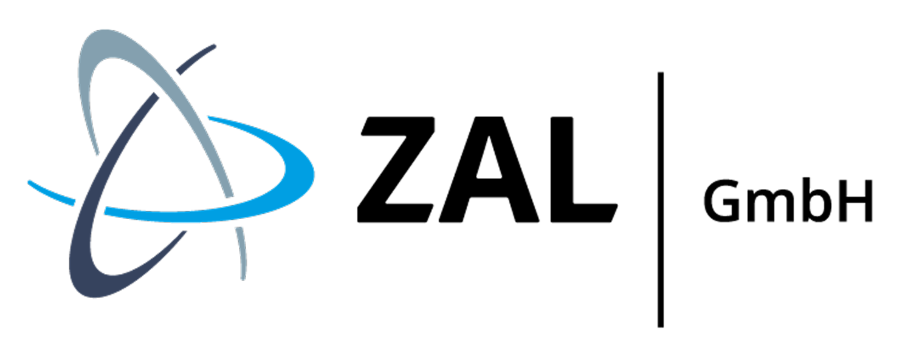
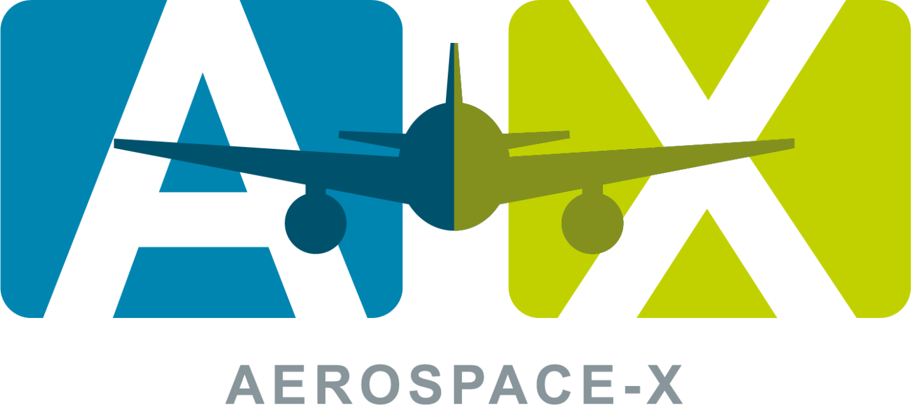
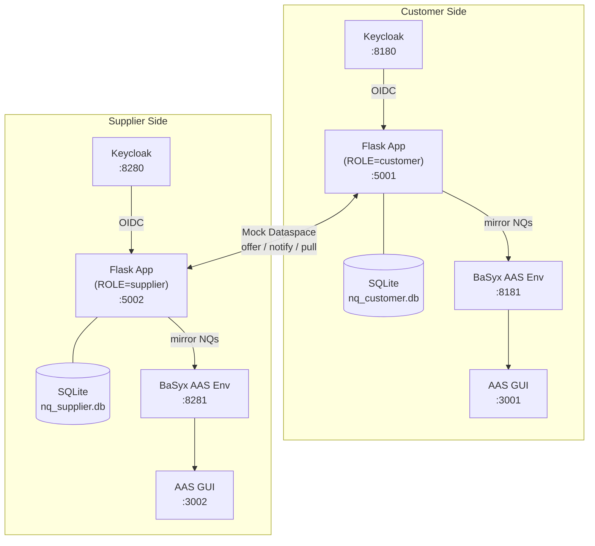

<div align="center">

<!-- Replace the line below with your actual logo once available -->
<table>
  <tr>
    <td width="50%">
      
    </td>
    <td width="50%">
      
    </td>
  </tr>
</table>

# Aerospace-X Non-Quality Cockpit

**Open-source Non-Quality collaboration cockpit for the aerospace supply chain**

[](LICENSE)
[](https://python.org)
[](https://flask.palletsprojects.com)
[](https://industrialdigitaltwin.org)
[](https://docs.docker.com/compose/)

</div>

---

## Table of Contents

- [Overview](#overview)
- [Quick Start (Docker)](#quick-start-docker)
  - [Browser Links](#browser-links)
  - [Walk the Workflow](#walk-the-workflow)
- [Features](#features)
- [Architecture](#architecture-with-mock-dataspace)
- [Live EDC Transport](#live-edc-transport)
- [Project Status](#project-status)
- [License](#license)

---

## Overview

Non-Quality (NQ) Cockpit is a self-contained, open-source demo of **non-conformance collaboration** between customer and supplier along the aerospace supply chain, built on the [Asset Administration Shell (AAS)](https://industrialdigitaltwin.org) data model — the Industry 4.0 standard for digital twins.

A single `docker compose up` command brings up a **complete two-party system** (customer instance + supplier instance) on one machine so you can walk the entire Non-Quality workflow end-to-end without any external infrastructure.

The dataspace transport (normally an [Eclipse Dataspace Connector](https://eclipse-edc.github.io/docs/)) is **mocked but structurally correct** — it follows the real pull-based shape (`publish → notify → catalog → negotiate → fetch`), so a real EDC can be plugged in later without restructuring the application code.

This repository is developed by ZAL GmbH in the scope of the [Aerospace-X](https://www.aerospace-x.net/en.html) project, funded by the German Federal Ministry for Economic Affairs and Energy (BMWE) as part of the Manufacturing-X funding program.

---

## Quick Start (Docker)

**Prerequisites:** Docker with Compose V2 (Docker Desktop with the WSL2 backend on Windows).

```bash
# 1. Clone the repository
git clone https://github.com/your-org/nq-cockpit.git
cd nq-cockpit

# 2. Start all services
docker compose up --build
```

Startup takes roughly 30–60 seconds on first run while Keycloak initialises.

The defaults work as-is for the local demo. To override anything (e.g. `SECRET_KEY`
for a real deployment), copy `.env.example` to `.env` and adjust — `docker compose`
picks it up automatically.

### Browser Links

Once all services are healthy, open any of the following in your browser:

| URL | What you get | Credentials |
|---|---|---|
| **http://localhost:5001** | **Customer portal** — create and track NQ reports, share them with the supplier, view supplier responses | `customer` / `customer` |
| **http://localhost:5002** | **Supplier portal** — receive NQ notifications, fetch asset data, add dispositions and containment actions | `supplier` / `supplier` |
| http://localhost:3001 | **Customer AAS twin viewer** — browse each NQ as a structured digital twin (AAS shells + submodels) | *(no login)* |
| http://localhost:3002 | **Supplier AAS twin viewer** — browse each NQ as a structured digital twin (AAS shells + submodels) | *(no login)* |
| http://localhost:8180 | **Customer Keycloak admin** — manage users, realm settings, and OIDC clients for the customer side | `admin` / `admin` |
| http://localhost:8280 | **Supplier Keycloak admin** — manage users, realm settings, and OIDC clients for the supplier side | `admin` / `admin` |

> **Tip:** The AAS twin viewers (`:3001` / `:3002`) are most useful after you have shared at least one NQ — open `http://localhost:8181` in the URL field of the viewer to connect to the Customer AAS Environment.

### Walk the Workflow

For a detailed screen-by-screen walkthrough, see [docs/WALKTHROUGH.md](docs/WALKTHROUGH.md).

---

## Features

| Feature | Details |
|---|---|
| **Non-Quality lifecycle** | Create, share and close NQ reports, disposition and containment actions  |
| **AAS data model** | `ShareNonQuality`, `Disposition`, and `ContainmentAction` submodels, unchanged from the aerospace-x spec |
| **Digital twin viewer** | Each NQ is mirrored into a BaSyx AAS Environment and can be browsed in the AAS GUI |
| **Pluggable transport** | Mock dataspace (default), can be switched to real Eclipse Dataspace Connector (switch to `edc` in the EDC Cockpit) |
| **OIDC authentication** | Keycloak-backed login per side; auto-login dev mode when Keycloak is absent |
| **Single-image, dual-role** | One Docker image, two containers — `ROLE=customer` or `ROLE=supplier` |
| **Defect file uploads** | Attach defect images/documents to an NQ; supplier can view them over the dataspace |

---

## Architecture (With mock dataspace)

Two independent application instances communicate only through a well-defined dataspace interface. Each side has its own database, identity, and AAS environment.



## Live EDC Transport

By default the cockpit uses a **mock transport** — the two app instances talk directly to each other over HTTP, simulating the dataspace protocol locally. This is enough to explore the full workflow on one machine.

The cockpit also offers the opportunity to switch to the EDC ([Eclipse Dataspace Components (EDC)](https://eclipse-edc.github.io/docs/)) live mode, if the user provides the two connectors' details (Customer & Supplier) in the EDC management cockpit. **The cockpit requires that the two connectors should be running on the same device.**

 **Current status:** `EdcTransport` (`transport/edc.py`) implements the full management-API v3 flow shown in [docs/WALKTHROUGH.md](docs/WALKTHROUGH.md). It has not yet been exercised against a live connector deployment. The user is required to refactor and adapt the code to the connector deployment specifications. The vision is to make this cockpit pluggable to any EDC connector.

>**Note**: In a real multi-organisation deployment each side runs its own EDC Connector, and all asset exchange goes through those connectors. This is out of the scope for this demonstration and is only intended to present a vision of a de-centralized communication across aerospace supply chain.

### How it works

The EDC follows a **pull-based** protocol. The provider registers an asset and waits; the consumer negotiates a contract, initiates a transfer, and fetches the data using a short-lived bearer token issued by the provider's connector. The mock already mirrors this shape, so the seam between the two transports is a thin implementation of the same `Transport` interface. See [docs/WALKTHROUGH.md](docs/WALKTHROUGH.md) for EDC workflow visualization.

---

## Project Status

This repository was developed within the [Aerospace-X](https://www.aerospace-x.net/en.html) project, which has concluded. It is published as-is for reference and reuse and is **not actively maintained** — issues and pull requests may not receive a response. Forks are welcome under the terms of the licenses below.

---

## License
This repository is dual-licensed:

- **Code** is licensed under the **Apache License, Version 2.0** — see [LICENSE](LICENSE).
- **Non-code content** (documentation, images, configuration) is licensed under **Creative Commons Attribution 4.0 International (CC BY 4.0)** — see [LICENSE_non-code](LICENSE_non-code).

See [NOTICE.md](NOTICE.md) for project attribution, funding information, trademark notes, and third-party licenses.
