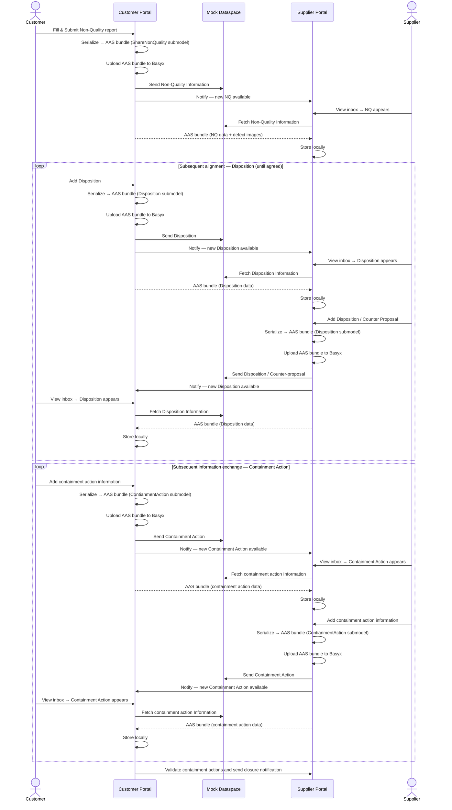
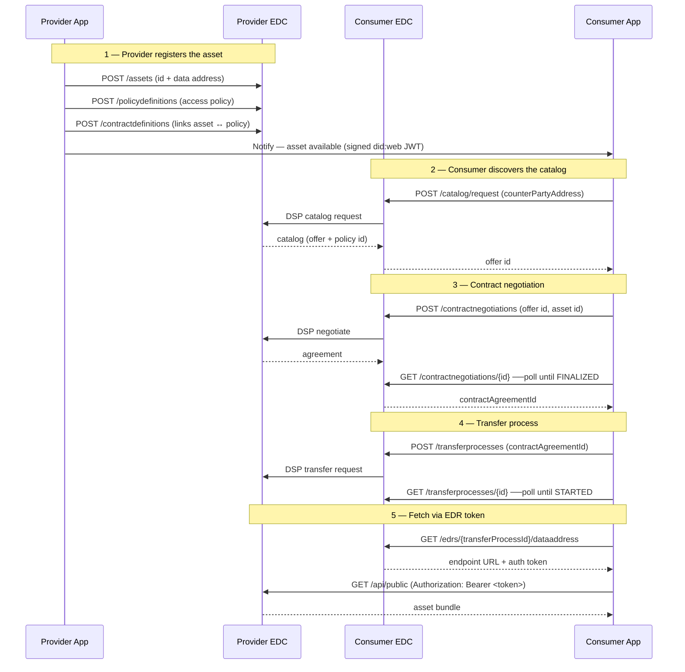

# Non-Quality Cockpit — Step-by-Step Walkthrough

This guide walks you through a complete customer ⇄ supplier Non-Quality (NQ) workflow from first login to closure. Run through it in order.

**Prerequisites:** The application is running. If it is not, start it with `docker compose up --build`.
See [README.md](README.md) for setup instructions, all browser URLs, credentials, and configuration.

> **Field descriptions:** Every form field has an **ⓘ icon** next to its label. Hover over it for a description of that field. Required fields are marked with `*`.

---

## Contents

1. [Log in as customer](#1-log-in-as-customer)
2. [Customer dashboard](#2-customer-dashboard)
3. [Create a Non-Quality report](#3-create-a-non-quality-report)
4. [Log in as supplier](#4-log-in-as-supplier)
5. [Supplier inbox — receive the notification](#5-supplier-inbox--receive-the-notification)
6. [Fetch the NQ asset](#6-fetch-the-nq-asset)
7. [Supplier: view the NQ detail](#7-supplier-view-the-nq-detail)
8. [Supplier/Customer: add a Disposition](#8-suppliercustomer-add-a-disposition)
9. [Supplier: add a Containment Action](#9-suppliercustomer-add-a-containment-action)
10. [See counter party's response](#10-see-counter-partys-response)
11. [Customer: edit the NQ](#11-customer-edit-the-nq)
12. [Customer: close the NQ](#12-customer-close-the-nq)
13. [View the digital twin in the AAS viewer](#13-view-the-digital-twin-in-the-aas-viewer)
14. [Workflow Overview](#14-workflow-overview)
15. [Tips and troubleshooting](#15-tips-and-troubleshooting)

---

## 1. Log in as customer

1. Open **http://localhost:5001** in a browser tab.
2. You are redirected to the Keycloak login page — enter the customer credentials from [README.md](README.md#browser-links) and click **Sign In**.

---

## 2. Customer dashboard

After signing in, you land on the customer portal from which you can access the Data Exchange Cockpit and the EDC Management Cockpit. Click the `Non-Quality Data Exchange Cockpit` Button. Then click on `Create and View Non Qualities`.

The dashboard shows a table of all NQ reports owned by this customer instance.

- **New NQ** button (top right) — opens the creation form.
- **View Details** — opens the NQ detail page.
- Home icon (⌂) in the header — returns to the portal selection.

---

## 3. Create a Non-Quality report

Click **+ New NQ**. The form is divided into sections — fill each one in turn:

1. **Non-Quality General Data** — title and optional customer comment.
2. **Part Identification** — select a **Customer Part** from the dropdown to auto-fill many fields below; otherwise fill in manually.
3. **Defect Description** — describe the problem and optionally upload defect images and documents. Uploaded files are served to the supplier over the dataspace.
4. **Defect Discovery** — where, when, and how the defect was found.
5. **Impacted Purchase Order** — purchase order number and position.
6. **Partner Collaboration** — ACAGE codes and site details for both sides.
7. **Product Scope** *(optional)* — programme and commodity context.
8. **Access Control** — in mock mode the partner is pre-configured; in EDC mode select the supplier DID.

Once all required fields (`*`) are filled, click **Submit**. The app assigns an NQ ID, saves it, serialises it into an AAS `ShareNonQuality` bundle, publishes it to the dataspace, and notifies the supplier — a progress bar shows each step. You are returned to the dashboard when complete.

---

## 4. Log in as supplier

Open **http://localhost:5002** in a **second browser tab**. Log in with the supplier credentials from [README.md](README.md#browser-links).

Click the `Non-Quality Data Exchange Cockpit` Button. Then click on the notification.

---

## 5. Supplier inbox — receive the notification

The inbox has two sections:

**Notifications (top)** — a banner lists pending NQs with:
- NQ ID and a short message from the customer
- **Fetch asset** button — pull the NQ data
- **Dismiss** button — discard the notification without fetching

> The notification only signals availability. The actual AAS bundle is not transferred until the supplier explicitly fetches it — matching the pull-based dataspace model.

**Fetched NQs table (bottom)** — NQs already pulled, with Status and a **View Details** link.

---

## 6. Fetch the NQ asset

Click **Fetch asset** in the Notifications section. The app runs the pull sequence:

| Step | What happens |
|---|---|
| 1. Catalog | Query the customer's mock catalog for the asset |
| 2. Negotiate | Negotiate a contract for the asset |
| 3. Transfer | Initiate the transfer process |
| 4. Fetch | Download the AAS bundle and store it locally |

A progress bar tracks each step. When done, you are forwarded to the fetched NQ detail view.

---

## 7. Supplier: view the NQ detail

The NQ detail page shows all data the customer entered — Part Identification, Defect Description (with images inline), Defect Discovery, Product Scope, and Collaboration Partners.

Below the NQ data are two action areas: **Dispositions** and **Immediate Containment**.

---

## 8. Supplier/Customer: add a Disposition

A disposition is the formal proposal for resolving the Non-Quality (e.g. rework, scrap, use-as-is).

1. Scroll to the **Dispositions** section and click **Create New Disposition**.
2. Fill in the form — hover the **ⓘ** icons for field descriptions.
3. Click **Send Disposition**.

The NQ bundle is re-serialised with the new `Disposition` submodel and published. The counter party will see the notification automatically on their next view of this NQ. After fetching the asset, they will be able to see the details. See [this section](#10-see-counter-partys-response) for details.

> Multiple dispositions can be added. All are shown in a list above the form, with differences between rounds highlighted to make negotiation history easy to follow.

A party accepts/rejects the dispositions which are reflected on the other side after sending the approval/rejection.

After a round of different proposals, one disposition can be finalized, which both the parties agree on.

---

## 9. Supplier/Customer: add a Containment Action

A containment action is an immediate step taken to limit the impact after the formal disposition is being agreed.

1. Scroll to the **Immediate Containment** section and click **Create New Containment Action**.
2. Fill in the form — hover the **ⓘ** icons for field descriptions.
3. Click **Create Containment Action**.

The action is saved and the NQ bundle is updated. Each containment action also has its own detail page, reachable by clicking its title in the list.

The counter party will see the notification automatically on their next view of this NQ. After fetching the asset, they will be able to see the details. See [this section](#10-see-counter-partys-response) for details.

---

## 10. See counter party's response

Switch back to the counter party tab (**http://localhost:5001 OR http://localhost:5002**) and open the NQ detail page. Fetch the disposition / immediate containment by clicking the **Fetch asset** button similar to fetching the Non-Quality for the first time. You will see:

- The **Dispositions** section now contains the new disposition(s).
- The **Immediate Containment** section shows the new containment action(s).

---

## 11. Customer: edit the NQ

To correct or update the NQ after creation:

1. On the NQ detail page, click **Edit**.
2. The form is pre-filled with current data — all fields are editable except the NQ ID.
3. Click **Save**.

The NQ is re-published with a `NQ_UPDATED` event. The supplier sees the updated data on their next view.

---

## 12. Customer: close the NQ

Once resolved:

1. On the NQ detail page, scroll to the bottom and click **Close Non-Quality**.
2. Status changes to **Closed** and the button is greyed out.

Closed NQs remain visible in both dashboards.

---

## 13. View the digital twin in the AAS viewer

Every NQ is mirrored into a BaSyx AAS Environment as a structured digital twin.

**Customer viewer** — open http://localhost:3001

**Supplier viewer** — open http://localhost:3002

Each NQ appears as an AAS shell with submodels: **ShareNonQuality**, **Disposition** (if added), and **ContainmentAction** (one per action). Click any submodel to browse its properties.

> The AAS Environment is in-memory — its contents reset on container restart. The SQLite database persists across restarts, so the NQs survive but will not reappear in the viewer until the next write operation for each NQ.

---

## 14. Workflow Overview

### Mock Workflow

---
### Live EDC Communication (Replacement of "Mock Dataspace")

---

## 15. Tips and troubleshooting

### Supplier does not see a notification

- Confirm both containers are healthy (`docker compose ps`).
- The notification is an HTTP POST from the customer app to the supplier app. If `PARTNER_URL` is misconfigured the call fails silently. In Docker the default (`http://app-supplier:5000`) always resolves.
- Check container logs: `docker compose logs app-customer`.

### Fetch fails or returns no data

- The supplier fetches from the customer over the internal Docker network. If the customer container is not running, the pull fails. Locally, confirm both processes are on ports 5001 and 5002.

### AAS viewer shows no shells

- The AAS Environment is in-memory. Create or re-save at least one NQ after a restart to repopulate it.

### Keycloak login redirect fails

- Keycloak takes 15–30 s to start. If you see a connection-refused error right after `docker compose up`, wait and reload.
